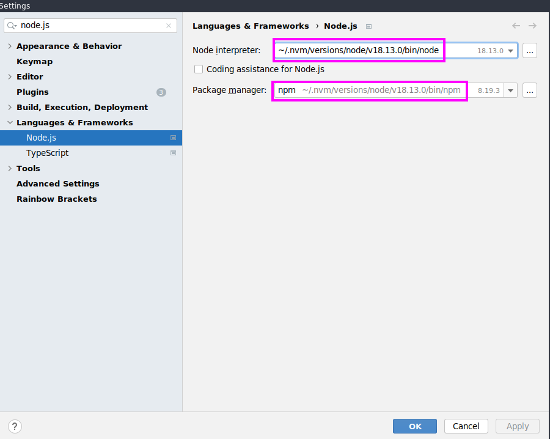

# Winslow 

## Prerequisite
This Project is designed to be used for a _Linux Environment_. <br>
:warning: It is not tested for a Windows Environment. :warning:

### Software dependencies
* Docker
* Java 17
* Maven 3.6.3
* Angular 17
* Node 18.13.0
* npm 8.19.3

## How to Start
This is an universal step-by-step approach, the **commands and directories are dependent on each other**.
1. Checkout the master branch:
    * `cd $HOME; git clone https://github.com/IT-Designers/winslow.git`
1. Create a workdir, for example in the project root:
    * `cd winslow && mkdir workdir`
* run the project 
  * **without** an IDE then goto [Run locally](README.md#run-locally)
  * **with** an IDE then goto [Run with IDE](README.md#setup-local-development)
## Run locally
**Important:** Do the steps from [How to Start](README.md#how-to-start) first and then come back.
1. Build & Start the Frontend:
   * `(cd ui-ng && npm install && npm build && npm run start)`
1. Build the Backend:
   * `mvn package`
1. Set environment variables, these are example values and can be adjusted (see [workdir](README.md#required)):

   * 
     ```
     export WINSLOW_DEV_ENV=true
     export WINSLOW_DEV_ENV_IP=192.168.1.178
     export WINSLOW_NO_GPU_USAGE=0
     export WINSLOW_NO_STAGE_EXECUTION=0
     export WINSLOW_DEV_REMOTE_USER=example
     export WINSLOW_ROOT_USERS=example
     ```
     Adjust the `WINSLOW_WORK_DIRECTORY` to an absolut path which points to the workdir from [how to start](README.md#how-to-start) <br>
       - Example: `WINSLOW_WORK_DIRECTORY=/home/itdesigners/winslow/workdir`
     ```
     export WINSLOW_WORK_DIRECTORY=<absolut-path-to-winslow-workdir-folder>
     ```
1. Start the Backend:
     * `(cd application/target && java -jar winslow-application*.jar)`

## Setup Local Development
Currently only [intellij setup](README.md#intellij-setup) is documented, feel free to add documentation for other environments. <br>
If you encounter a problem, see the [troubleshooting](README.md#troubleshooting) section.
<br>
**Important:** Do the steps from [How to Start](README.md#how-to-start) first and then come back.
### Intellij SetUp
> [!NOTE]
> Read this step in the markdown preview of Intellij to finish the setup.
#### Project Configuration
* Open settings and select a compatible node and npm version as mentioned in [Prerequisite](README.md#software-dependencies)
<br>


#### Start Backend
Click here to start backend: `winslow-application`

#### Start Frontend
Click here to start frontend: `start fe`

## More Information
### Environment Variables
#### required
* `WINSLOW_WORK_DIRECTORY` Absolut path to the working directory that has to be on a nfs
  * Example `/winslow/workdirectory/that/is/on/nfs`
#### optional
* `WINSLOW_NO_STAGE_EXECUTION` stage execution, act as observer / web-accessor
  * `Values`
    * `1` disable 
    * `0` enable stage execution, act as observer / web-accessor
<br>
<br>
* `WINSLOW_DEV_ENV` auth and allows root access to all resources
  * `Values`
    * `true` disables
    * `false` enables
<br>
<br>
* `WINSLOW_DEV_REMOTE_USER` username to assign to (unauthorized) requests
<br>
<br>
* `WINSLOW_DEV_ENV_IP` publicly visible IP of the WEB-UI
  * Example:  192.168.1.178
<br>
<br>
* `WINSLOW_NO_GPU_USAGE` access to GPUs
  * `Values`
    * `0` disables
    * `1` enables
<br>
<br>
* `WINSLOW_NO_WEB_API` REST/WebSocket-API (no longer starts Spring Boot)
  * `Values`
    * `1` disable 
    * `0` enables
* `WINSLOW_ROOT_USERS` users with root access

#### NFS-Server WHAT ABOUT THIS?
Install `nfs-kernel-server`: `sudo apt install nfs-kernel-server` and update `/etc/export`:

```nfs
/path/to/nfs-export *(rw,no_root_squash,all_squash,fsid=1,anonuid=0,anongid=0) 172.0.0.0/8(rw,no_root_squash,all_squash,fsid=1,anonuid=0,anongid=0)
/path/to/nfs-export/run *(rw,no_root_squash,all_squash,fsid=2,anonuid=0,anongid=0) 172.0.0.0/8(rw,no_root_squash,all_squash,fsid=2,anonuid=0,anongid=0)

```


Add to `/etc/fstab` an entry to mount the nfs directory

```fstab
<your-pc-name>:/path/to/nfs-export /home/<username>/path/to/nfs-mount nfs noauto 0 0

# winslow/run store very small temporary files, making it a tmpfs makes it faster (ram-fs)
tmpfs /path/to/nfs-export/run tmpfs size=1G,mode=760,noauto 0 0
```


Run the following script (`./start-nfs-server.sh`):

```bash
#!/bin/bash

sudo mount nfs-export/run
sudo service nfs-kernel-server restart
sleep 5
sudo mount nfs-mount
```

## Troubleshooting
### 1. The documentation said _click here_ but there is nothing to click?
* Make sure you are reading this in the markdown preview from Intellij
