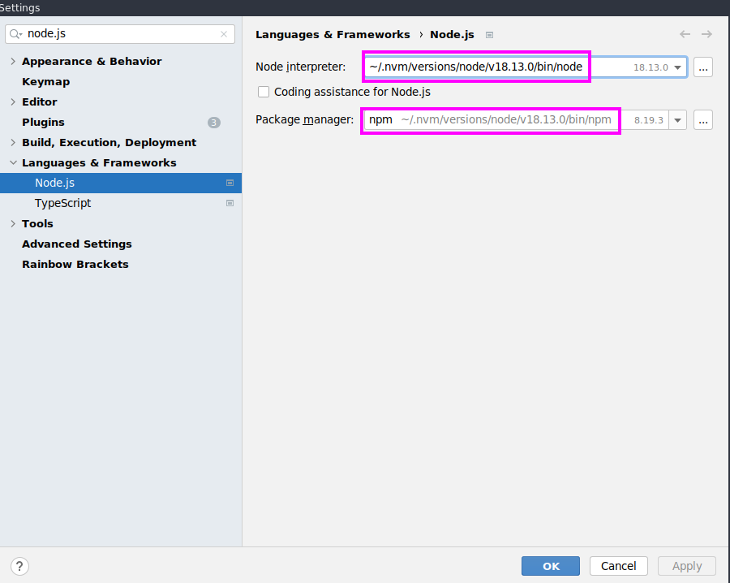

[](https://github.com/IT-Designers/winslow/actions/workflows/github-ci.yaml)
# Winslow 
TODO: Explain what is winslow!

## Prerequisite
This Project is designed to be used for a _Linux Environment_. <br>
:warning: It is not tested for a Windows Environment. :warning:

### Software dependencies
* Docker
* Java 17
* Maven 3.6.3
* Angular 17
* Node 18.13.0
* npm 8.19.3

## Starting with Docker
See [Winslow Docker Image](node/README.md#Winslow-Docker-Image) for more information.
## Starting from Source
This is a universal step-by-step approach, the **commands and directories are dependent on each other**.
1. Checkout the master branch:
    * `cd $HOME; git clone https://github.com/IT-Designers/winslow.git`
1. Create a workdir, for example in the project root:
    * `cd winslow && mkdir workdir`
* run the project 
  * **without** an IDE then goto [Run locally](README.md#run-locally)
  * **with** an IDE then goto [Run with IDE](README.md#setup-local-development)
## Run locally
**Important:** Do the steps from [How to Start](README.md#how-to-start) first and then come back.
1. Build & Start the Frontend:
   * `(cd ui-ng && npm install && npm run build && npm run start)`
1. Build the Backend:
   * `mvn package`
1. Set environment variables, these are example values and can be adjusted (see [workdir](README.md#required)):

   * 
     ```
     export WINSLOW_DEV_ENV=true
     export WINSLOW_DEV_ENV_IP=192.168.1.178
     export WINSLOW_NO_GPU_USAGE=0
     export WINSLOW_NO_STAGE_EXECUTION=0
     export WINSLOW_DEV_REMOTE_USER=example
     export WINSLOW_ROOT_USERS=example
     ```
     Adjust the `WINSLOW_WORK_DIRECTORY` to an absolut path which points to the workdir from [how to start](README.md#how-to-start) <br>
       - Example: `WINSLOW_WORK_DIRECTORY=/home/itdesigners/winslow/workdir`
     ```
     export WINSLOW_WORK_DIRECTORY=<absolut-path-to-winslow-workdir-folder>
     ```
1. Start the Backend:
     * `(cd application/target && java -jar winslow-application*.jar)`

## Setup Local Development
Currently only [intellij setup](README.md#intellij-setup) is documented, feel free to add documentation for other environments. <br>
If you encounter a problem, see the [troubleshooting](README.md#troubleshooting) section.
<br>
**Important:** Do the steps from [How to Start](README.md#how-to-start) first and then come back.
### Intellij SetUp
> [!NOTE]
> Read this step in the markdown preview of Intellij to finish the setup.
#### Project Configuration
* Open settings and select a compatible node and npm version as mentioned in [Prerequisite](README.md#software-dependencies)



#### Start Backend
Click here to start backend: `winslow-application`
<br>
(There is also a visual guide to configure the backend: [Visual Guide](docs/visual_guide.md#configure-backend))

#### Start Frontend
Click here to start frontend: `start fe`

