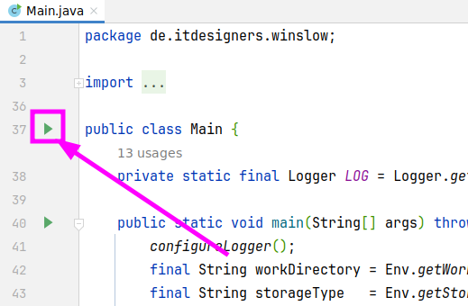
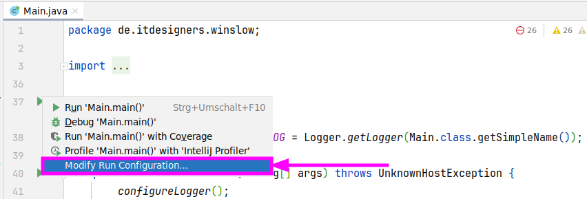
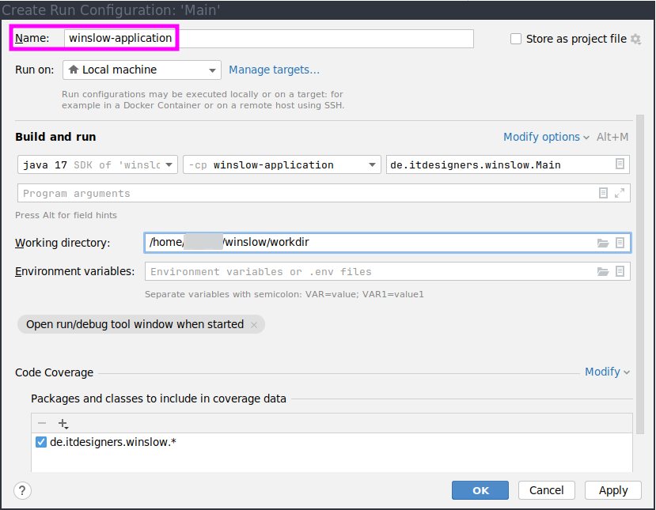

# Winslow 

## Prerequisite
This Project is designed to be used for a Linux Environment.
:warning It is not tested for a Windows Environment. :warning

Software dependencies:
* Docker
* Java 17
* Maven 3.6.3
* Angular 17
* Node 18.13.0
* npm 8.19.3

## How to Start
This is an universal step-by-step approach, the **commands and directories are dependent on each other**.
1. Checkout the master branch:
    * `cd $HOME; git clone https://github.com/IT-Designers/winslow.git`
1. Create a workdir, for example in the project root:
    * `cd winslow && mkdir workdir`
* run the project 
  * **without** an IDE then goto [Run locally](README.md#run-locally)
  * **with** an IDE then goto [Run with IDE](README.md#setup-local-development)
### Run locally
**Important:** Do the steps from [How to Start](README.md#how-to-start) first and then come back.
1. Build & Start the Frontend:
   * `(cd ui-ng && npm install && npm build && npm run start)`
1. Build the Backend:
   * `mvn package`
1. Set environment variables, these are example values and can be adjusted (see [workdir](README.md#required) ):
   * 
     ```
     export WINSLOW_DEV_ENV=true
     export WINSLOW_DEV_ENV_IP=192.168.1.178
     export WINSLOW_NO_GPU_USAGE=0
     export WINSLOW_NO_STAGE_EXECUTION=0
     export WINSLOW_WORK_DIRECTORY=$HOME/winslow/workdir
     export WINSLOW_DEV_REMOTE_USER=example
     export WINSLOW_ROOT_USERS=example
     ```
     Important: `WINSLOW_WORK_DIRECTORY` has to be an absolut path!
1. Start the Backend:
     * `(cd application/target && java -jar winslow-application*.jar)`

---
## Setup Local Development
Currently only [intellij setup](README.md#intellij-setup) is documented, feel free to add documentation for other environments. <br>
**Important:** Do the steps from [How to Start](README.md#how-to-start) first and then come back.
### Intellij SetUp
#### Configure Backend
1. Search for the `Main.java` file
1. Click on the green play button
   * 
1. Select `Modify Run Configuration...`
   * 
1. Adjust `Name` to your needs, e.g. `winslow-application`
   * 
1. Use the environment variables from the section [how to start](README.md#how-to-start)
   * ```
     WINSLOW_DEV_ENV=true; WINSLOW_DEV_ENV_IP=192.168.1.178; WINSLOW_NO_GPU_USAGE=0; WINSLOW_NO_STAGE_EXECUTION=0; WINSLOW_WORK_DIRECTORY=$HOME/winslow/workdir; WINSLOW_DEV_REMOTE_USER=example; WINSLOW_ROOT_USERS=example
     ``` 
     
1. Save the changes
#### Configure Frontend


## More Information
### Environment Variables
#### required
* `WINSLOW_WORK_DIRECTORY` Absolut path to the working directory that has to be on a nfs
  * Example `/winslow/workdirectory/that/is/on/nfs`
#### optional
* `WINSLOW_NO_STAGE_EXECUTION` stage execution, act as observer / web-accessor
  * `Values`
    * `1` disable 
    * `0` enable stage execution, act as observer / web-accessor
<br>
<br>
* `WINSLOW_DEV_ENV` auth and allows root access to all resources
  * `Values`
    * `true` disables
    * `false` enables
<br>
<br>
* `WINSLOW_DEV_REMOTE_USER` username to assign to (unauthorized) requests
<br>
<br>
* `WINSLOW_DEV_ENV_IP` publicly visible IP of the WEB-UI
  * Example:  192.168.1.178
<br>
<br>
* `WINSLOW_NO_GPU_USAGE` access to GPUs
  * `Values`
    * `0` disables
    * `1` enables
<br>
<br>
* `WINSLOW_NO_WEB_API` REST/WebSocket-API (no longer starts Spring Boot)
  * `Values`
    * `1` disable 
    * `0` enables
* `WINSLOW_ROOT_USERS` users with root access

---
Winslow requires a reachable nomad instance on localhost and the work directory to be a NFS-mount (`/etc/fstab` is parsed to determine the NFS-Server-Path if `WINSLOW_STORAGE_TYPE` and `WINSLOW_STORAGE_PATH` is not set).

#### Configuration
To configure Winslow, Environment variables are used (which also allows the docker image of Winslow to be configure in the same way). The following subset is useful for the local dev environment (see [`de.itdesigners.winslow.Env`](application/src/main/java/de/itdesigners/winslow/Env.java) for the complete list):

```bash
# required
WINSLOW_WORK_DIRECTORY=/winslow/workdirectory/that/is/on/nfs

# optional
WINSLOW_NO_STAGE_EXECUTION=1 # disable stage execution, act as observer / web-accessor
WINSLOW_DEV_ENV=true # disables auth and allows root access to all resources
WINSLOW_DEV_REMOTE_USER=mi7wa6 # username to assign to (unauthorized) requests
WINSLOW_DEV_ENV_IP=192.168.1.178 # publicly visible IP of the WEB-UI
WINSLOW_NO_GPU_USAGE=0 # disable access to GPUs
WINSLOW_NO_WEB_API=1 # disable REST/WebSocket-API (no longer starts Spring Boot)
WINSLOW_ROOT_USERS=mi7wa6 # users with root access

# ask IT for credentials
WINSLOW_LDAP_MANAGER_PASSWORD=... 
WINSLOW_LDAP_MANAGER_DN=cn=...,dc=...,dc=...
WINSLOW_LDAP_URL=ldaps://ldap1.../ ldaps://ldap2.../
WINSLOW_LDAP_GROUP_SEARCH_BASE=ou=Groups,ou=...,dc=...,dc=...
WINSLOW_LDAP_USER_SEARCH_BASE=ou=Users,ou=...,dc=...,dc=...
```

These environment variables can be set in the `Run/Debug Configuration` in IntelliJ.

#### Nomad DEPRECATED

Download nomad via https://www.nomadproject.io/downloads and run it with
```bash
nomad agent --config nomad.hcl
```

An up to date version of the configuration can be found [here](../../../../docker/-/blob/master/nomad.hcl):
```hcl
datacenter = "local"
data_dir = "/tmp/nomad-data-dir"

server {
  enabled = true
  bootstrap_expect = 1
}

client {
  enabled = true
}

plugin "docker" {
  config {
    allow_privileged = true

    gc {
      image_delay = "96h"
    }

    volumes {
      enabled = true
    }
  
  }
}
```

#### NFS-Server

Install `nfs-kernel-server`: `sudo apt install nfs-kernel-server` and update `/etc/export`:

```nfs
/path/to/nfs-export *(rw,no_root_squash,all_squash,fsid=1,anonuid=0,anongid=0) 172.0.0.0/8(rw,no_root_squash,all_squash,fsid=1,anonuid=0,anongid=0)
/path/to/nfs-export/run *(rw,no_root_squash,all_squash,fsid=2,anonuid=0,anongid=0) 172.0.0.0/8(rw,no_root_squash,all_squash,fsid=2,anonuid=0,anongid=0)

```


Add to `/etc/fstab` an entry to mount the nfs directory

```fstab
<your-pc-name>:/path/to/nfs-export /home/<username>/path/to/nfs-mount nfs noauto 0 0

# winslow/run store very small temporary files, making it a tmpfs makes it faster (ram-fs)
tmpfs /path/to/nfs-export/run tmpfs size=1G,mode=760,noauto 0 0
```


Run the following script (`./start-nfs-server.sh`):

```bash
#!/bin/bash

sudo mount nfs-export/run
sudo service nfs-kernel-server restart
sleep 5
sudo mount nfs-mount
```
