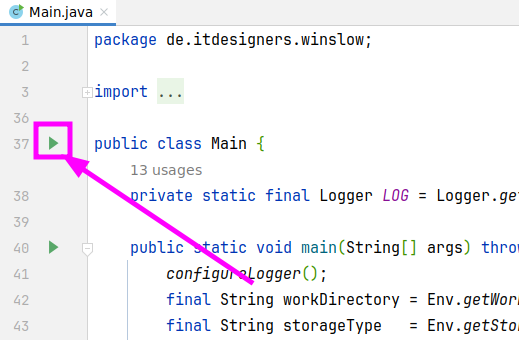
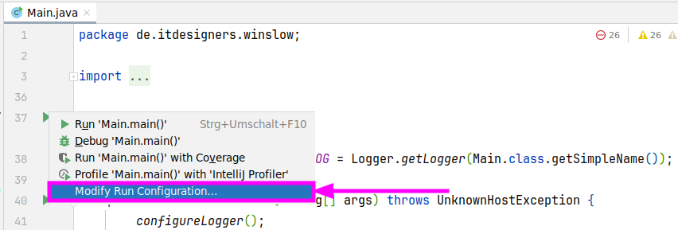
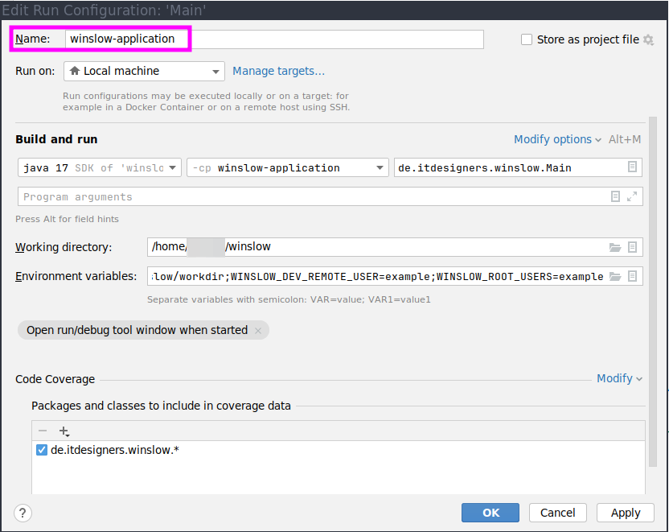
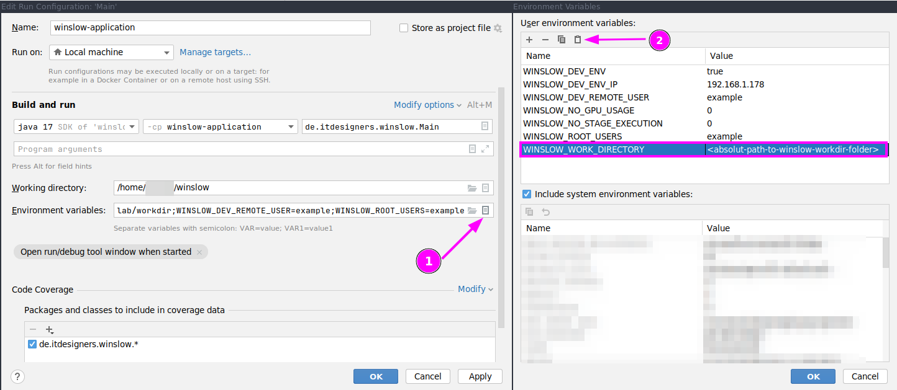

# Visual Guide
#### Configure Backend
1. Search for the `Main.java` file
1. Click on the green play button
    * 
1. Select `Modify Run Configuration...`
    * 
1. Adjust `Name` to your needs, e.g. `winslow-application`
    * 
1. These are the same environment variables from [how to start](../README.md#how-to-start) but in a copy-paste friendly format:
   * ```
      WINSLOW_DEV_ENV=true; WINSLOW_DEV_ENV_IP=192.168.1.178; WINSLOW_NO_GPU_USAGE=0; WINSLOW_NO_STAGE_EXECUTION=0; WINSLOW_DEV_REMOTE_USER=example; WINSLOW_ROOT_USERS=example;
      ```
   * Adjust the `WINSLOW_WORK_DIRECTORY` to an absolut path which points to the workdir from [how to start](../README.md#how-to-start) <br>
           - Example: `WINSLOW_WORK_DIRECTORY=/home/itdesigners/winslow/workdir`
   * WINSLOW_WORK_DIRECTORY=<absolut-path-to-winslow-workdir-folder>
   * 
1. Save the changes
